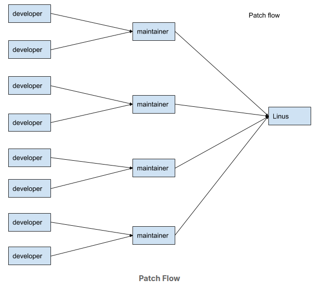

# [LFD103] Guide to Linux kernel development

## Course legends


---
### How often would a kernel release take?
> 10 to 11 weeks and it's time based not feature based.

### Show linux development life cycle?
1. After releasing a mainline release, Linus Torvalds opens PR window for 2 weeks
2. publishes a release cycle **rc1**, and would take around a week for bug fixing and regressions
3. then would do number of **rcX** upto 7 or 8 weeks until feels confident of the release quality


### Active kernel releases?
1. Release Candidate (RC) (pre-release)
> Linux x.y-rc: as (x) is a major relase number and (y) a minor number. and (rc) used to denote that this release used for integration and regressions testing afther the merge window closes.  
2. Stable
> Stable releases are bug-fix-only releases. so after Linus releases a mainline kernel, it moves into stable mode. (it gets periodically patches once a week or as-needed basis)  
3. Longterm (LTS)
> Longterm releases are stable releases selected for long-term maintenance to provide critical bug fixes for older kenel trees.
---

### Kernel Trees - what are they?
1. the mainline kernel tree: managed by **Linus Torvalds**
2. the stable tree: managed by **Greg Kroah-Hartman**
3. the linux-next tree: managed by **Stephen Rothwell**
```
 This is an integration tree. Code from many subsystem trees is periodically pulled into this tree and then released for integration testing. Pulling changes from various trees catches merge conflicts (if any) between trees.
```
> Use case
```
One of Shuah's first actions as a maintainer was to request that her tree be added to linux-next. After she commits patches to her tree, Shuah waits 3 to 7 days before sending a pull request to Linus, giving enough time to find problems and regressions, if any. Patches applied to a tree that will be added to linux-next are only for the next merge window, including during the merge window. Patches for the next release may be added to linux-next after the merge window has closed, and the rc1 candidate has been released by Linus.
```
---
### Sybsystem Maintainers
> Each major subsystem has its own tree and designated maintainer(s).

---

## Patches
### What is a patch?
> $ git format-patch -1 --pretty=fuller **COMMIT-SHA**  
> it gives you a compelete information about the change  
1. Commit ID: SHA-1 hash
2. Commit header: subsystem:sub-driver: do_func() return path OR subsystem/sub-driver: do_func() return path  
2.1. usbip:usbip_host: cleanup do_rebind() return path  
2.2. usbip/usbip_host: cleanup do_rebind() return path  
3. Commit log: answers in details the what and why?
4. Author: name, email address as configured in .gitconfig.  
4.1. P.S. the Signed-off-by should match the address from which you send patches.  
5. AuthorDate: time-date of a commit (comes from dev-computer time system)
6. Commit: commiter's name and email.
7. CommitDate: the time-date of applying this patch to the subsystem tree.
8. signed-off-by: Developers certify the patch to be their original work or have the right to pass it on as an open source patch.
---

## Tags
### 1. Acked-by
```
This tag is often used by the maintainer of the affected code when that maintainer neither contributed to nor forwarded the patch. For example, Shuah maintains the usbip driver and she uses the Acked-by tag to ask the USB maintainer to pick patches sent by other developers.

✅ The reviewer agrees with the technical correctness and intent of the patch
✅ The reviewer believes it is appropriate for the subsystem
❌ The reviewer is not the author
❌ The reviewer is not necessarily the maintainer
❌ It does not guarantee testing, only agreement
```

### 2. Reviewed-by
```
This tag indicates that the patch has been reviewed by the person named in the tag.

✅ The reviewer read the patch in detail
✅ The reviewer checked logic, correctness, and design
✅ The reviewer agrees the patch is ready to be merged
❌ It does not imply testing (that’s Tested-by)
❌ It does not imply authorship or responsibility for merging
```

### 3. Reported-by
```
This tag gives credit to people who find bugs and report them.

✅ Identifies the original bug reporter
✅ Can be a developer, tester, or end user
❌ The reporter did not necessarily provide a fix
❌ It does not imply review or approval
```

### 4. Tested-by
```
This tag indicates that the patch has been tested by the person named in the tag.

✅ The patch was compiled and/or executed
✅ The test did not expose failures or regressions
❌ It does not imply code review
❌ It does not imply approval of design or correctness
```

### 5. Suggested-by
```
This tag is used to give credit for the patch idea to the person named in the tag.

✅ Credits conceptual contribution
✅ The suggestion may be high-level or detailed
❌ The suggester is not the author
❌ It does not imply review, testing, or approval
```

### 6. Fixes
```
This tag indicates that the patch fixes an issue in a previous commit referenced by its Commit ID. This tag allows us to track where the bug originated.

✅ Links a bug fix to the exact faulty commit
✅ Helps maintainers and tools understand where the bug came from
✅ Enables automatic stable backporting
```
---
## Patch email subject line convention
```
Let's find out how to prefix patch email subject lines. The [PATCH] prefix is used to indicate that the email consists of a patch. [PATCH RFC] or [RFC PATCH] indicates the author is requesting comments on the patch. RFC stands for "Request For Comments". [PATCH v4] is used to indicate that the patch is the 4th version of this specific change that is being submitted. It is not unusual for a patch to go through a few revisions before it gets accepted. This is an artifact of collaborative development. The goal is to get the code right and not rush it in.
```

## Patch Version History
```
Including the patch version history when sending a re-worked patch is required. The patch revision history on what changed between the current and the previous versions is added “---” and “start of the diff” in the patch file. Any text that is added here gets thrown away and will not be included in the commit when it is merged into the source tree. Including information that helps with reviews and doesn't add value to the commit log here is good practice. Please check mailing lists to get a feel for what information gets added here.

Do not send new patch versions as a reply to a previous version. Start a new thread for each version of a patch. An example description of what changed is: "Changes since v3: Added null check for <variable name> as suggested by <name>." You can see a patch example with version history for the v2 version.
https://patchwork.kernel.org/project/linux-kselftest/patch/20190926224014.28910-1-skhan@linuxfoundation.org/
```
---
## Linux Kernel Contributor Covenant Code of Conduct
> contributors and maintainers pledge to foster an open and welcoming community to participate in and become part of.  
> For complains: conduct@kernel.org  

## LICENSE
> GPL-2
---
## Configuring Development System
> 1. install any Linux distro
> 2. make the boot partion 3GB
> 3. install following tools
``
sudo apt-get install build-essential vim git cscope libncurses-dev libssl-dev bison flex
sudo apt-get install git-email
others: https://www.kernel.org/doc/html/latest/process/changes.html
``

## Email client 
### Configuration
1. it's recommended to send patches and respond to emails using email client **git send-email**
2. steps to config your email-client: https://www.kernel.org/doc/html/latest/process/email-clients.html
```bash
[sendemail]
	smtpserver = smtp.gmail.com
	smtpserverport = 587
	smtpencryption = tls
	smtpuser = ahmed.addakhakhny@gmail.com
	smtppass = abcd efgh ijkl mnop
```

### Things to remember
1. Bottom post: Never top post in your response. Top posting is writing a message above the original text while responding to an email. Add your response at the bottom of the original text. Bottom posting makes reading and following review comments on a patch easier.

2. Inline post: When reviewing or responding to a patch, deleting or stripping parts of the message you are not replying to is a good practice, and makes it easier to follow the responses in the thread.

3. No HTML format: Disable compose messages in HTML format. Patches sent using HTML format will be automatically rejected by the development mailing lists.

4. No attachments: Do not send patches as attachments.
In general, avoid attachments. Some exceptions are kernel logs or configuration files when reporting bugs.
---
## Clone linux workspace
1. **mainline:** git://git.kernel.org/pub/scm/linux/kernel/git/torvalds/linux.git
2. **stable:** git://git.kernel.org/pub/scm/linux/kernel/git/stable/linux-stable.git
3. **kselftest:** git://git.kernel.org/pub/scm/linux/kernel/git/shuah/linux-kselftest.git

### What is the difference between mainline and stable trees?
1. **mainline:** it's the development tree where developers contripute to it daily for feature and bugs dev.
2. **stable:** it's the release tree where being backported by crucial bug fixes only.

### Build Your First Kernel
1. Go to linux/stable/tree
2. Copy the configuration for current kernel from /boot: "i.e. config-6.8.0-90-generic" to **.config**  
2.1. cp /boot/config-6.8.0-90-generic .config  
3. Compile the kernel
```bash
# 1. Generate a kernel configuration file based on the courrent configuration
make oldconfig 
OR 
make olddefconfig # avoid answering the question, accept the default

# OR
# 2. Generate a kernel configuration file based on the currently loaded modules on your system
lsmod > tmp/my-lsmod
make LSMOD=/tmp/my-lsmod localmodconfig

make -j3 all
```

### Installing Your First Kernel
1. Once the kernel compilation is complete, install the new kernel
2. Store dmesg logs and compare and look for regressions and new errors, if any.
2. Reboot
```bash
# This command will install the new kernel and run update-grub to add the new kernel to the grub menu.
su -c "make modules_install install"

# dmesg logs ... [-t option allows logs without timestamps]
sudo dmesg -t > dmesg_current
sudo dmesg -t -k > dmesg_kernel
sudo dmesg -t -l emerg > dmesg_current_emerg
sudo dmesg -t -l alert > dmesg_current_alert
sudo dmesg -t -l crit > dmesg_current_crit
sudo dmesg -t -l err > dmesg_current_err
sudo dmesg -t -l warn > dmesg_current_warn
sudo dmesg -t -l info > dmesg_current_info
```

### Disable secure boot temporarly
1. mokutil --sb-state
2. sudo mokutil --disable-validation
3. mok password: 12345678 /* type the digit based upon the asked index */
4. sudo mokutil --enable-validation /* enable the secure boot if you need but you won't be able to boot unsigned kernels */

### Booting the kernel with logs
1. go to /etc/default/grup
2. Uncomment GRUB_TIMEOUT and set it to 10: GRUB_TIMEOUT=10
3. Comment out GRUB_TIMEOUT_STYLE=hidden
4. GRUB_CMDLINE_LINUX="earlyprintk=vga"
5. sudo update-grub
---
### How to recover from un-bootable kernel?
### How to roll over between multiple kernel versions?
---
## Write your first kernel patch
### 1. Setup Git configuration
#### A. centeral git config file
```bash
[user]
  name = Your Name (legal)
  email = your.email@example.com

[format]
      signoff = true

[core]  
      editor = vim

[sendemail]
      smtpserver     = mail.xxxx.com
      smtpserverport = portum
      smtpencryption = tls
      smtpuser       = user
      smtppass       = password
```
#### B. Add remote upstream to the mainline repo
```bash
$ git remote add linux git://git.kernel.org/pub/scm/linux/kernel/git/torvalds/linux.git
$ git fetch linux
# Pick a tag to rebase to
```

### 2. Setup kernel configuration
> For easy startup, you can apply your distro kernel configuration. but in reality you should configure it yourself. as the Linux kernel is entirely configurable. as drivers cab be configured to be installed and completely disabled. Here are three options for driver installation:  
1. Disabled
2. Built into the kernel (vmlinux image) to be loaded at boot timme
3. Built as a module to be loaded as needed using **modprobe** (better to avoid large kernel images as loading on demand if match with HW took place)

> Remark: in case you want to check the newly added configuration keys after copying confgis from /boot/config-6.x.x, just run **make listnewconfig** (run this command before **make olddefconfig**)  

### 3. Make changes to a driver
1. choose any driver of your choice **lsmod**. i.e. (uvcvideo)
2. find the .c and .h files for this driver
```bash
# search in the git repo for a file path that includes "uvbvideo" and specify the file/s (Makefile) that would contain this string
git grep uvcvideo -- '*Makefile'
```
3. configure CONFIG_USB_VIDEO_CLASS=m OR =y
4. Recompile your kernel and install. (in case of 'y - static' reboot the system)
5. **Commands:** sudo modprobe uvcvideo | sudo rmmod uvcvideo | sudo dmesg | lsmod
6. Check your coding style: https://www.kernel.org/doc/html/latest/process/coding-style.html
6.1. You can run **checkpatch.pl** on the diff or the generated patch to verify if your changes comply with the coding style.
7. Commit your changes, and make a patch of it **$git format-patch -1 <commit ID>**

### 4. What does **checkpatch.pl** do?
1. Checks a patch for coding style compliance
2. Checks a patch for spelling errors
3. Prompts for adding new files to MAINTAINERS files
4. Checks for mismatched “from” and “author” email addresses

### 5. How to write a commit message like a pro?
1. Separate subject from body with a blank line
2. Limit the subject to 50 characters
3. Capitalize the subject line
4. Don't end the subject line with a period
5. Use the imperative mood in the subject line
6. Wrap the body at 72 characters (configure your editor)
7. Use the body to explain what and why vs. how
```
Summarize changes in around 50 characters or less

More detailed explanatory text, if necessary. Wrap it to about 72
characters or so. In some contexts, the first line is treated as the
subject of the commit and the rest of the text as the body. The
blank line separating the summary from the body is critical (unless
you omit the body entirely); various tools like `log`, `shortlog`
and `rebase` can get confused if you run the two together.

Explain the problem that this commit is solving. Focus on why you
are making this change as opposed to how (the code explains that).
Are there side effects or other unintuitive consequences of this
change? Here's the place to explain them.

Further paragraphs come after blank lines.

 - Bullet points are okay, too

 - Typically a hyphen or asterisk is used for the bullet, preceded
   by a single space, with blank lines in between, but conventions
   vary here

If you use an issue tracker, put references to them at the bottom,
like this:

Resolves: #123
See also: #456, #789
```
### 6. Hot to get your patch ready?
1. To whom you send your patch: use **get_maintainer.pl** script
2. email destination:  
2.1. CC: Mailing lists shown in the **get_maintainer.pl**  
2.2. To: the rest; maintainers, commit signers, supporters  
```bash
# INPUT
$ scripts/get_maintainer.pl drivers/media/usb/uvc/uvc_driver.c 

# OUTPUT:
# Laurent Pinchart <laurent.pinchart@ideasonboard.com> (maintainer:USB VIDEO CLASS)
# Hans de Goede <hansg@kernel.org> (maintainer:USB VIDEO CLASS)
# Mauro Carvalho Chehab <mchehab@kernel.org> (maintainer:MEDIA INPUT INFRASTRUCTURE (V4L/DVB))
# linux-media@vger.kernel.org (open list:USB VIDEO CLASS)
# linux-kernel@vger.kernel.org (open list)

```
3. Generate a patch
```bash
$ git format-patch -1 <commit ID> --to=maintainer1 --to=maintainer2 --cc=maillist1 --cc=maillist2
```
4. send your patch: $ git send-email <patch_file>
5. Revision: add version history describing the changes made in the latest version. and the reviewer place is right below the **signed-off tag**
```bash
# example
changes since v1:
lib.mk needs DEFAULT_GOAL to run all
```
### Remark: Apply git hooks:
```bash
# If you already have a .git/hooks/post-commit file, move it to .git/hooks/post-commit.sample. git will not execute files with the .sample extension. Then, edit the .git/hooks/post-commit file to contain only the following lines:

#!/bin/bash
exec git show --format=email HEAD | ./scripts/checkpatch.pl --strict --codespell
# Make sure the file is executable:
chmod a+x .git/hooks/post-commit
```
---
## Kernel and driver building, loading and dependencies
> At the root of the linux tree run the following commands:  
1. Building Sinlge source file: 
```bash
make drivers/media/test-drivers/vimc/vimc-core.o
```
2. Building at directory level:
```bash
make dirvers/media/test-drivers/vimc/
```
3. Building a Module:
```bash
make M=dirvers/media/test-drivers/vimc/
```
> Remark: at checking kconfig of the **vimc** component, the key **CONFIG_VIDEO_CIMV** is subject to be tristate which means, it shall be (enabled as built-in, as a module, or disabled) and the select components are their dependancies. and all of that shall be configured in **.config** to be (m, y, n).  
> All configuration can be done visually using **$ make menuconfig** of all components' kconfig.  
> A driver or a module can only be enabled when all the dependencies are met.  
```bash
# Example of a Kconfig structure
# SPDX-License-Identifier: GPL-2.0-only
config VIDEO_VIMC
	tristate "Virtual Media Controller Driver (VIMC)"
	depends on VIDEO_DEV
	select FONT_SUPPORT
	select FONT_8x16
	select MEDIA_CONTROLLER
	select VIDEO_V4L2_SUBDEV_API
	select VIDEOBUF2_VMALLOC
	select VIDEOBUF2_DMA_CONTIG
	select VIDEO_V4L2_TPG
	help
	  Skeleton driver for Virtual Media Controller

	  This driver can be compared to the vivid driver for emulating
	  a media node that exposes a complex media topology. The topology
	  is hard coded for now but is meant to be highly configurable in
	  the future.

	  When in doubt, say N.
```
---
## Introduction to all about testing
> Developer testing, integration testing, regression testing, and stress testing.  

### List all automated build bots and CI test rings
1. Kernel CI Dashboard: https://kernelci.org/
2. Linaro QA: https://qa-reports.linaro.org/lkft/
3. Buildbot: https://kerneltests.org/
4. 0-DAY CI Kernel Test Service: https://github.com/intel/lkp-tests/wiki

### How to apply a patch:
1. apply without git tracking: $ patch -p1 < file.patch
2. apply with git tracking: $ git apply --index file.patch

### How to perform testing:
### 1. Basic testing
> Once a new kernel is installed, the next step is to try to boot it and see what happens. Once the new kernel is up and running, check dmesg for any regressions. Run a few usage tests: 
```
- Is networking (wifi or wired) functional?
- Does ssh work?
- Run rsync of a large file over ssh
- Run git clone and git pull
- Start a web browser
- Read email
- Download files: ftp, wget, etc.
- Play audio/video files
- Connect new USB devices - mouse, USB stick, etc.
```
### 2. Examining kernel logs
> Ensure no new crit, alert, err, and emerg
```bash
dmesg -t -l emerg
dmesg -t -l crit
dmesg -t -l alert
dmesg -t -l err
dmesg -t -l warn
dmesg -t -k
dmesg -t
```

### 3. Stress testing
```bash
# Running three to four kernel compiles in parallel is a good overall stress test. Download a few Linux kernel gits, stable, linux-next etc. Run timed compiles in parallel. Compare times with old runs of this test for regressions in performance. Longer compile times could be indicators of performance regression in one of the kernel modules.

# Performance problems are hard to debug. The first step is to detect them. Running several compiles in parallel is a good overall stress test that could be used as a performance regression test and overall kernel regression test, as it exercises various kernel modules like memory, filesystems, dma, and drivers.

time make all # build linux tree and log out the time needed for that built (real, user'cpu time spent in user space', sys'cpu time spent in kernel space')
```

### 4. Debug options:
> All suported debug options: git grep -r DEBUG | grep Kconfig
```bash
CONFIG_KASAN
CONFIG_KMSAN
CONFIG_UBSAN
CONFIG_LOCKDEP
CONFIG_PROVE_LOCKING
CONFIG_LOCKUP_DETECTOR
```
---
## Kernel Debugging basics
### 1. Debugging Overview
> Asking the following questions can help to understand and identify the nature of the probelm:
1. Is the problem easily reproducible?
2. Is there a reproducer or test that can trigger the bug consistently?
3. Are there any panic, error, or debug messages in dmesg when the bug is triggered?
4. Is reproducing the problem time-sensitive?

### 2. What is a panic message:
> Read the following blogs:
1. Debugging Analysis of Kernel panics and Kernel oopses using System Map: https://sanjeev1sharma.wordpress.com/tag/debug-kernel-panics/
2. Understanding a Kernel Oops!: https://www.opensourceforu.com/2011/01/understanding-a-kernel-oops/
### 3. Decode and Analyze the panic Message
1. Run the following script **decode_stacktrace.sh**  
1.1. Note: this article explains how to use this script: https://lwn.net/Articles/592724/  
2. simple example: scripts/decode_stacktrace.sh ./vmlinux < panic_trace.txt
```bash
 # Save (cut and paste) the panic trace in the dmesg between the two following lines of text into a .txt file.

------------[ cut here ]------------
---[ end trace …. ]---
```
### 4. Use Event Tracing to Debug
1. It's a way for debugging by **enable-ing events** on a running system, /sys/kernel/debug  
2. how to enable example : cd /sys/kernel/debug/tracing/events/skb; echo 1 > enable
2.2. note: under each directory there are **enable and trace** files.
1. Wiki: https://www.kernel.org/doc/html/latest/trace/events.html  
---
### 5. Sources to self-study kernel debugging
1. hunt bugs: https://www.kernel.org/doc/html/latest/admin-guide/bug-hunting.html
2. bisect a bug: https://www.kernel.org/doc/html/latest/admin-guide/bug-bisect.html
3. dynamic debugging: https://www.kernel.org/doc/html/latest/admin-guide/dynamic-debug-howto.html
4. contributors to the Linux Kernel: https://cregit.linuxsources.org/
5. who made that change and when: using cregit for debugging: http://www.gonehiking.org/ShuahLinuxBlogs/blog/2018/10/18/who-made-that-change-and-when-using-cregit-for-debugging/
---
## Git Commands
```bash
# Create a patch file
git format-patch -1 <commit ID>

# check those scripts
# 1. scripts/get_maintainer.pl
# 2. scripts/checkpatch.pl
# tbd: git clone git://git.kernel.org/pub/scm/linux/kernel/git/shuah/linux-kselftest.git
```
