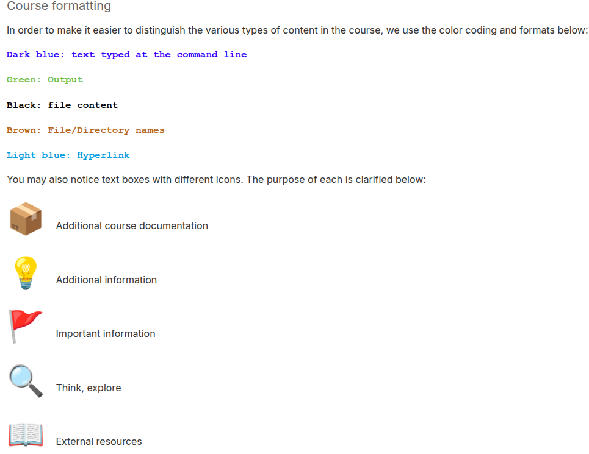
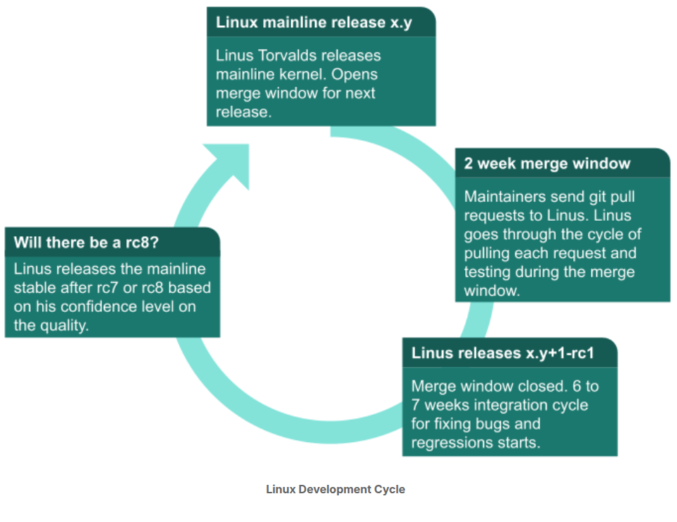

# Guide to Linux kernel development

## Course legends


---
### How often would a kernel release take?
> 10 to 11 weeks and it's time based not feature based.

### Show linux development life cycle?
1. After releasing a mainline release, Linus Torvalds opens PR window for 2 weeks
2. publishes a release cycle **rc1**, and would take around a week for bug fixing and regressions
3. then would do number of **rcX** upto 7 or 8 weeks until feels confident of the release quality


### Active kernel releases?
1. Release Candidate (RC) (pre-release)
> Linux x.y-rc: as (x) is a major relase number and (y) a minor number. and (rc) used to denote that this release used for integration and regressions testing afther the merge window closes.  
2. Stable
> Stable releases are bug-fix-only releases. so after Linus releases a mainline kernel, it moves into stable mode. (it gets periodically patches once a week or as-needed basis)  
3. Longterm (LTS)
> Longterm releases are stable releases selected for long-term maintenance to provide critical bug fixes for older kenel trees.
---

### Kernel Trees - what are they?
1. the mainline kernel tree: managed by **Linus Torvalds**
2. the stable tree: managed by **Greg Kroah-Hartman**
3. the linux-next tree: managed by **Stephen Rothwell**
```
 This is an integration tree. Code from many subsystem trees is periodically pulled into this tree and then released for integration testing. Pulling changes from various trees catches merge conflicts (if any) between trees.
```
> Use case
```
One of Shuah's first actions as a maintainer was to request that her tree be added to linux-next. After she commits patches to her tree, Shuah waits 3 to 7 days before sending a pull request to Linus, giving enough time to find problems and regressions, if any. Patches applied to a tree that will be added to linux-next are only for the next merge window, including during the merge window. Patches for the next release may be added to linux-next after the merge window has closed, and the rc1 candidate has been released by Linus.
```
---
### Sybsystem Maintainers
> Each major subsystem has its own tree and designated maintainer(s).

---

## Patches
### What is a patch?
> $ git format-patch -1 --pretty=fuller **COMMIT-SHA**  
> it gives you a compelete information about the change  
1. Commit ID: SHA-1 hash
2. Commit header: subsystem:sub-driver: do_func() return path OR subsystem/sub-driver: do_func() return path  
2.1. usbip:usbip_host: cleanup do_rebind() return path  
2.2. usbip/usbip_host: cleanup do_rebind() return path  
3. Commit log: answers in details the what and why?
4. Author: name, email address as configured in .gitconfig.  
4.1. P.S. the Signed-off-by should match the address from which you send patches.  
5. AuthorDate: time-date of a commit (comes from dev-computer time system)
6. Commit: commiter's name and email.
7. CommitDate: the time-date of applying this patch to the subsystem tree.
8. signed-off-by: Developers certify the patch to be their original work or have the right to pass it on as an open source patch.