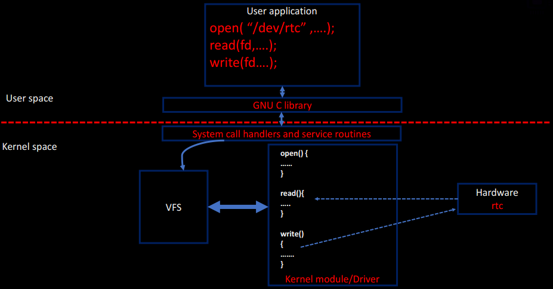

# Linux Device Driver

### What is a device driver?
> it's a piece of code configures & manages a device (i.e. sensor).  
> Whenever the driver is loaded, it exposes interfaces (files) to the userspace .. under /dev/.  

### What are the types of device driver?
> Character device drivers (sream of bytes).  
> Block device drivers.  
> Network device derivers.

### How the user space interact with LDD?
> By means of device files.  
> normally, userspace shall be able to do open(), read(), write().  
```bash
P.S. every file operation gets called from the user space will be handled by a (open, read, werite) handler method existed in the driver. and the bind between the userspace call and the driver handler happends by means of the "VFS".
```

### Exercise: Implement a Pseudo character driver?
```bash
# Description:
1. Write a character driver to deal with a pseudo character device
2. the pseudo-device is a memory buffer of some size
3. the driver what you write must support reading, writeing and seeking to this device.
4. test the driver functionality by running user-level command such as echo, dd, cat and by writing user level programs.
```

### Show the user-space to kernel-space layered diagram?


### What is a **Device File**?
> It's an exposed file to be an interface to help/ease the communication between the userspace and the driver module.  
> **VFS:** is responsible for the communication between the userspace and the LDD.  
> **Major:Minor** each device file shall be defined with these numbers.  
> **Major:** Device number  
> **Minor:** Device instances    

### Show abstract steps to connect between the device file access and the driver?
### How does the kenel "VFS" forward the userspace file operation on the device file to the required device driver handler?
```bash
1. Create device number
2. Create device files
3. Make a char device registration with the VFS (CDEV_ADD)
4. Implement the driver's file operation methods for open, read, writes, llseek, etc.
```

### Essential Kernel APIs and utilities to be used in driver code?
##### Creation
```bash
# one: include/linux/fs.h
alloc_chrdev_region();

# two: include/linux/cdev.h
cdev_init();
cdev_add();

# three: include/linux/device.h
class_create();
device_create();
```
##### Deletion
```bash
# one: include/linux/fs.h
unregister_chrdev_region();

# two: include/linux/cdev.h
cdev_del();

# three: include/linux/device.h
class_destroy();
device_destroy();
```

### How to register a range of char device numbers?
```C
int alloc_chrdev_region(
    dev_t *dev, /*output parameter for first assigned number*/
    unsigned baseminor, /*the start value of the range of minor numbers. normally is 0*/
    unsigned count, /*number of minor numbers required. ... [count - baseminor] = [no. of device files] to be created for this driver*/
    const char *name /*Name of the associated device files range*/
);

    // Example
    dev_t device_number;
    status = alloc_chrdev_region(&device_number, 0, 6, "eeprom");

    // <--------------------------------eeprom------------------------------->
    //    127:0   |   127:1   |   127:2   |   127:3   |   127:4   |   127:5     

    // 127. the major number generated by the kernel
    // :0. the start minor number defined by user.
    // 0~5. the range of device files and being differentiated among each other by their minor number.
```
### More about device number representation?
> **dev_t** is a (typedef of u32) and holds both Major and Minor numbers.  
> 12 bits for Major, 20 bits for minor, and can be extracted using the below MACROS.  
```C
    #include <inux/kdev_t.h>

    dev_t device_number;
    // extract major and minor
    int minor_no = MINOR(device_number);
    int minor_no = MAJOR(device_number);

    // compose  major and minor 
    dev_t dev_num = MKDEV(int major, int minor);
```
