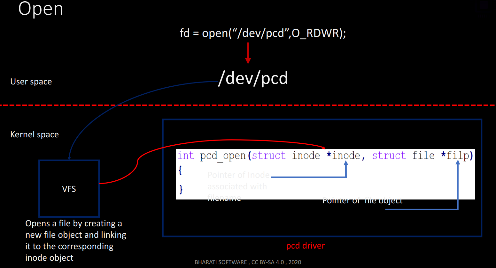
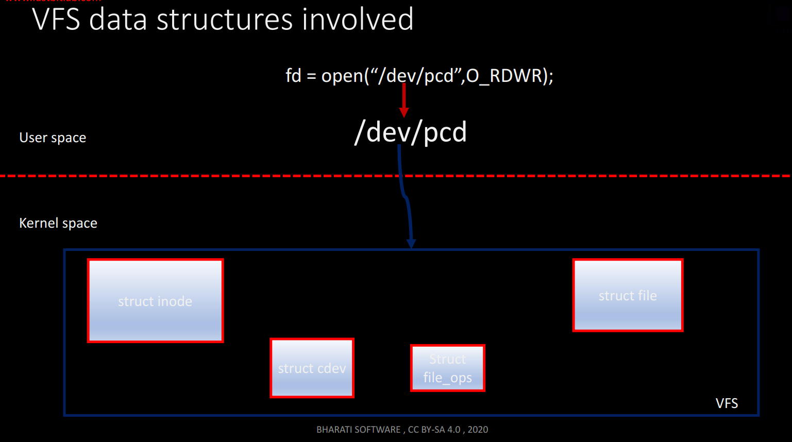

# Steps to write a pseudo char device driver

### 1. Create Device Number

### 2. Make a CDD registeration with the VFS
> it's important to let the user level systems calls won't be connected to the file operation methods of the driver.
```C
// header: #include <linux/cdev.h>
//! initialize a cdev structure

// cdev: structure to initialize
// fops: file operations for this device
void cdev_init(struct cdev *cdev, const struct file_operations *fops);
// briefly this function initializes cdev object with the THIS_MODULE and the fops that shall be executed by this device.

//! Add a char device to the kernel VFS

// cdev: cdev structure for the device
// dev: first device number for which this device is responsible
// count: no. of consectuive minor numbers corresponing to this device
int cdev_add(struct cdev *p, dev_t dev, unsigned count);
// briefly this function register a device with the VFS
```
---
### 3. Character driver file operation methods
> open, read, write, llseek, release  
#### Demonestrate the flow of handling an open function briefly?
1. an open system call method being invoked for a specific file.
2. the VFS would invoke the device open method, and pass two parameters .. inode and file objects.

#### What are the VFS data structures involved?
> struct inode, struct cdev, struct file_ops, struct file


### what is inode object?
1. it's a VFS data structure (struct inode) that holds general information about the file.
### What is file object?
> it's a data structure (struct file) that tracks interactions on an opened file by the user process (stores info about the interaction between an open file and a process)  
> for each open operation there is a file object gets created in the kernel.  
---
#### 3.1 Open method
```C
// open method signature
int pcd_open(struct inode *inode, struct file *filp) { return 0;}
```
> Note: open method is optional. if not provided, open will always succeed and driver isn't notified.

#### 3.2 close method
```C
// release method signature
int pcd_release(struct inode *inode, struct file *file) { return 0;}
```
> Note: it's being triggered when all the references to an open file is closed.


#### 3.3 Read method
```C
/*
 * filp: pointer of file object
 * buff: pointer of user buffer
 * __user: optional macro which alerts the programmer that this is a user level pointer. It cann't be trusted for direct dereferencing
 * count: Read count given by user
 * f_pos: pointer of current file position from which the read has to begin
*/
ssize_t pcd_read(struct file *filp, char __user *buff,
                 size_t count, loff_t *f_pos) {return 0;}
```
> Remark: never dereference user level ptr. instead ues dedicated kernel functions such as **copy_to_user()** and **copy_from_user()**.

#### 3.4 Write method
```C
/*
 * filp: pointer of file object
 * buff: pointer of user buffer
 * __user: optional macro which alerts the programmer that this is a user level pointer. It cann't be trusted for direct dereferencing
 * count: Write count given by user
 * f_pos: pointer of current file position from which the write has to begin
*/
ssize_t pcd_write(struct file *filp, const char __user *buff,
                 size_t count, loff_t *f_pos) {return 0;}
```


#### 4.5 llseek method
> llseek used to alter the current file position
```C
/*
 * filp: pointer of file object
 * off: offset value
 * whence: origin {SEEK_SET, SEEK_CUR, SEEK_END} ... It controls how to use "off".
 * return: newly updated file position or error.
 * 
 * SEEK_SET: the file offset is set to 'off' bytes.
 * SEEK_CUR: the file offset is set to its current location plus 'off' bytes
 * SEEK_END: the file offset is set to the size of the file plus 'off'bytes
*/
loff_t pcd_lseek(sturct file *filp, loff_t off, int whence);
```