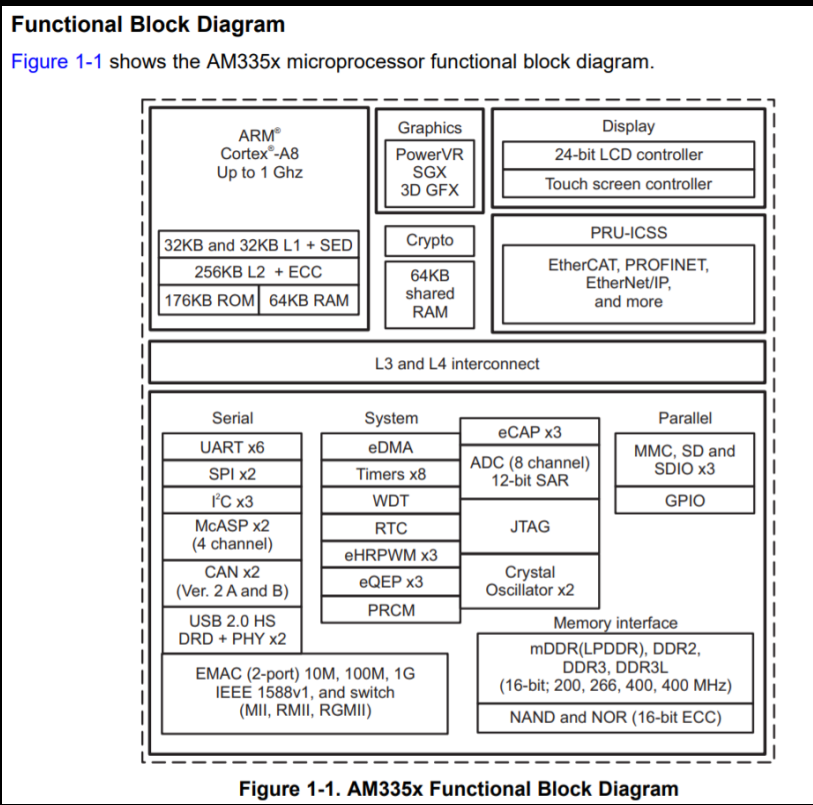

# Platform bus, devices and drivers

### 1. What is a platform devie?
> it's a device that can't be self discovered by the kernel.

### 2. What is a platform driver?
> it's a driver that deals with a platform device and platform driver could be char, block, or network driver.   

### 3. What is a platform bus?
1. it's  pseudo bus or virtual bus. it doesn't have any physical existence. (it's a linux terminology)
2. it is a logical place holder or a container that contains all the undiscoverable devices on the SoC that the kernel must be told about manually via DT.
2. it's used to interact with interfaces that don't have auto dicoverable and hot plugging capability.
3. Remark: the PC has a standard bus called IPC which it's a bus performs the interconnect between the CPU and the peripheral and capable to perform self discovery.
> Remark: SoC peripherals don't need to be hot pluggable as they are permenent on the chip not as the PC (you can add/remove components).

### 4. What device information that shall Kernel be aware of?
1. Memory or I/O mapped base address
2. IRQ number
3. DMA channel
4. PIN config ... etc.

### 5. How to add platform device info to the kernel?
1. During kernel boot: using device tree blob (recommended method)  
2. Hard conding the board information (obsolete methodo)

### 6. What is Device tree?
1. DT was created by **Open Firmware** then concept was adopted by linux org.
2. It's used to avoid hardcoding for the chips inside the kernel.

### 7. Show BBB platform peripherals/controllers??


### 8. Show the BBB pltform peripherals/controllers firmware dirvers?
| Peripheral                      | Location / Driver Path                                   | Description                                           |
|---------------------------------|-----------------------------------------------------------|-------------------------------------------------------|
| SPI                             | drivers/spi/spi-omap2-mcspi.c                            | OMAP2 McSPI controller driver                         |
| I2C                             | drivers/i2c/busses/i2c-omap.c                            | TI OMAP I2C master mode driver                        |
| USB OTG                         | drivers/usb/musb/musb_am335x.c                           | MUSB controller                                       |
| CAN (C_CAN controller)          | drivers/net/can/c_can/c_can_platform.c                   | Platform CAN bus driver for Bosch C_CAN controller    |
| MMC                             | drivers/mmc/host/omap_hsmmc.c                            | Driver for OMAP2430/3430 MMC controller               |
| GPIO                            | drivers/gpio/gpio-omap.c                                 | Support functions for OMAP GPIO                       |
| UART                            | drivers/tty/serial/8250/8250_omap.c                      | 8250-core based driver for the OMAP internal UART     |
| LCD controller                  | drivers/gpu/drm/tilcdc/tilcdc_drv.c                      | LCDC DRM driver, based on da8xx-fb                    |
| Touch screen controller         | drivers/input/touchscreen/ti_am335x_tsc.c                | TI Touch Screen driver                                |

---

# Registering platform device and driver (Hard coded methodology - Obsolete)

### 1. Registeration
> To register a platform driver  
1. Create a object of the platform driver, which would compose important call back functions (probe)
2. Register this object to the linux platform core
3. Create an object of the platform device, which would compose device description attriputes (deprecated)
4. Register this object to the linux pltaform core (deprecated)
> Remark: use this header for using the needed Kernel APIs **/linux/platform_device.h8**
```C
    #include <include/linux/platform_device.h>
    // 1. Create instance of platform driver for your driver
    struct platform_driver drv = {
        .probe = pcd_probe,
        .remove = pcd_remove,
        .id_table = pcd_id_table
    };

    // 2. Register the platform driver using the following MACRO
    platform_driver_register(&drv);

    // 3. Create instance of platform device for your device
    struct platform_device dev = {
        .name = "pcd_dev_1",
    };

    // 4. Register the platform device using the following function
    platform_device_register(&dev);
```
### 2. Matching mechanism
1. The linux platform core implementaion maintains platform device and driver lists. whenever you add a new platform device or driver, this list gets updated and matching mechanism triggers.
2. Then The platform bus core looks for the needed platform drivers for each platform device, that is known by 'matching' mechanism.
3. Once match detected either match by name, id or device tree node, the probe function of the driver gets called with the "device" as an argument.

### What shall probe function  of the platform driver do?
> It runs whenever a match took place.
1. Device detection - Verify that the specified device HW actually exists
2. Device initialization
3. Memory allocation for various data structures
4. Memory mapping i/o
5. Register interrupt handlers
6. Registering device to kernel framework
> returns 0 at success, otherwise an error code.

### What shall remove function  of the platform driver do?
> It runs once a device get removed
1. Unregister the device from the kernel
2. Free allocated memory
3. Shutdown/De-initialize the device
---

## Excerice Description
1. Adapt the multiple device driver example to handle probe() and remove()
2. Create another kernel module to act as a platform device
2.1. Create 2 platform devices and initialize them with required information (name, platform data, id of the device, release function for the device)
3. Register platform devices with the linux kernel

### Create platform devices
1. create your user-define structure that holds your device private data
2. create instanse of platform_device
3. initialize the platform_device instance with (name, id, dev_private_date, dev_release)
4. register to the platform bus core
5. Result: after module registeration, check the /sys/devices/platform/pseudo-char-device .. as they would be exposed over there.

```C
struct pcdev_platform_data pcdev_private_pdata = {
    .size = DEV_BUFFER_PCDEV1,
    .serial_number = "PCDEV1XXXABC123",
    .perm = RDWR
};

struct platform_device platform_pcdev = {
    .name = "pseudo-char-device",
    .id = 1,
    .dev = {
        .platform_data = &pcdev_private_pdata,
        .release = pcdev_release
    }
};

void pcdev_release(struct device *dev) {
    // do relase 
    // free dynamic memory allocation
}
```

### Create platform driver
1. Create instace of struct platform_driver
1.1 Initialize this instance with the callbacks of probe() and release() methods
1.2 Initialize this instance with a matching name
2. Implement the __init and __exit methods  
2.1 to register the driver to the platform bus core    
2.2 to unregister the driver from the platform bus   
3. implement the probe() method   
3.1. Allocate dynamicall memory for detected devices
```C
kmalloc()
kfree()

```
4. Implement the release method  
5. Implemet file operations
> Remark: the probe and release methods runs before the methods of the device __init, __exit, release()
---
### Explain dynamic memory allocation in kernel spacce?
```C
#include include/linux/slab.h
// MAX allocated size is limited, based on target, good practice, use it with objects less than page size, ARM 4Kib (4 * 1024 Bytes)
// flags: changes the behavious of the underlying memory allocator
//  there are many flags, but mainly the flag decides if the service would go to sleep or not, in case of no space left in RAM
// 1. GFP_KERNEL: Allocate mormal kernel ram. May sleep.
// 2. GFP_ATOMIC: Allocation will nt sleep. May use emergency pools (use it inside ISR)
void* kmalloc(size_t size, gfp_t flags);
void* kzalloc(size_t size, gfp_t flags); // preferablly to be used, as initialize allocated memory with 0, to avoid wild pointer behaviours


// Usage
struct bar *k;
k = kmalloc(sizeof(*k), GFP_KERNEL);
if(!k)
    return -ENOMEM;

//--
// don't free a non-allocated memory bykmalloc(), otherwise will run into trouble
void kfree(const void *objp);
kfree(k);

//--
// other functions.
kzfree(); // same as kfree()
krealloc(); // resize heap by allocating another place with a new size
```