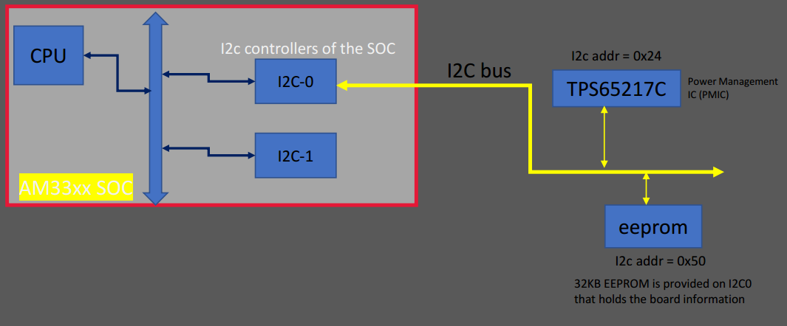
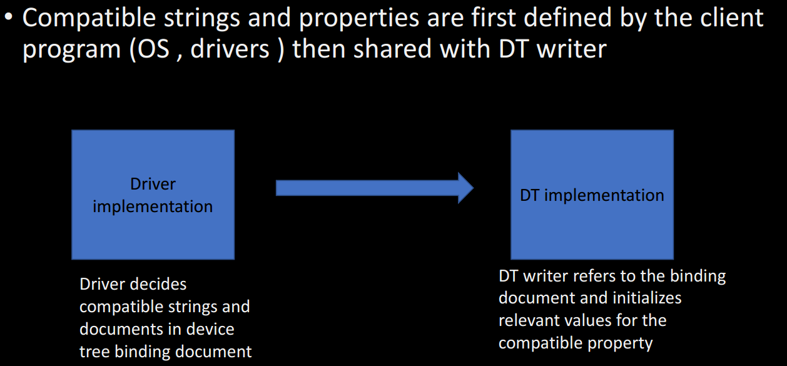

# Device tree

### 1. What is device tree (DT)?
1. It's a way of data exchange format used for exchanging HW description data with the SW or OS.
2. A way to describe non-discoverable devices (platform devices) to the linux kernel

### 2. How to get device tree specification?
> https://www.devicetree.org  

### 3. How to write a device tree?
> Note: There is hierarchy for the DT as the HW has one. hierarchy might differ from target to another.  

> 1. SOC level  
> 2. SOC has an on-chip peripherals level  
> 3. The board peripherals level, like sensors, LEDs, buttons  

### 4. Where is the location of the device tree files?
> /arch/arm/boot/dts/**Silicon-Provider**

### 5. Explain the modular approach to manage DT files on Beaglebone Black?
> Note: top level nodes overrides the low level nodes (these levels are defined by my of studying purposes)
1. level 1: AM335x.dtsi
2. level 2: Beagle-bone-common.dtsi
3. level 3: Beaglebone-black-common.dtsi
4. level 4: beaglebone-black.dts |OR| beaglebone black wireless.dts (includes all of the above)

### 6. Explain device tree structure?
1. Every device tree file should contain a root node.
```C
/ { /* root node*/

    Node-1 { /* SOC level node | device node*/
        Child-Node-1 { /* Child node of node-1 | device node*/

        };
    };

    Node-2 { /* SOC level node | Device node*/
        Child-Node-1 { /* Child node of node-1, sibling of Child-Node-2 | device node*/

        };

        Child-Node-2 { /* Child node of node-1 | device node*/

        };
    };
};
```


---
## Device tree writing syntax
1. Node name
2. Node label
3. Standard and non-standard property names
4. Data types (u32, byte, byte stream, string, stream of strings, boolean, etc)
> Remark: Check the device tree specifications for all guidelines

### 7. Explain **Node name**?
1. node-name@unit-address | node-name@unit-base-address | i2c@44e0b000
2. node-name: write it to descripe the general class of device, perfer lowercase, - and digits.
3. unit-address: it's optional as depends on the node  i.e. peripheral address, it's used when there is a reg property, other wise ommit it. (root node doesn't have address).
> reg property: reg = <base_address size>
```C
/{
    i2c@44e0b000{
        /* some properties */
        reg = <44e0b000 0x10000>;
    };
};
```

### 8. Explain **label**?
1. it's an aliase of a node name as node name sometimes be long.
2. label name should be unique.
```C
/{
    i2c0: i2c@44e0b000{
        /* some properties */
        reg = <44e0b000 0x10000>;
    };
};
```

### 9. Write sudo i2c nodes?

```C
&i2c0 { /*De-reference this node */
    /* Overwrite properties of the parent node */
    status = "okay";

    tps@24 { /* Define a child node */
        reg = <0x24>;
    };

    eeprom@50 { /* Define a child node */
        reg = <0x50>;
    };
} 
```
---
### 10. What are Device tree properties?
1. it's a key-value pair , where key is considered the property name

### 11. List types of properties?
1. standard properties
2. non-standard properties: contain prefix+comma (linux,default-trigger = "heartbeat")

### 12. explain **compatible** property?
> it's used for device driver selection that would be managed by the matching mechanism
1. it's of string list data type (compatible = "hello","world";)
2. value written from most specific to most general
3. recommended naming: "manufacturer,model" ("fsl,mpc8641)
> Remark: if the first driver isn't found, the the second one will be used for the matching and so on.

### 13. How to know what are the provided properties of a specific node?
### 13. How to implement a devie node proberly?
> Refer to the device tree binding document: "Documentation/devicetree/bindings/i2c/i2comap.txt"  
> where there would be a detailed description for each property and an example.


### 14. if you have a sensor and there is an available device driver for it in the kernel, how to write its device node example temperature sensor lm75?
> similar to question 13. 
1. go to "Documentation/devicetree/bindings/hwmon/lm75.txt"
2. check the compatible strings, and the recommended example.
```C
sensor48 {
    compatible = "st,stlm75";
    reg = <0x48>;
};
```


### 14. Linux conventions to write device tree?
```
• hex constants are lower case
    • use "0x" instead of "0X"
    • use a..f instead of A..F, eg 0xf instead of 0xF
• node names
    • should begin with a character in the range 'a' to 'z', 'A' to 'Z'
    • unit-address does not have a leading "0x" (the number is assumed to be hexadecimal)
    • unit-address does not have leading zeros
    • use dash "-" instead of underscore "_"
• label names
    • should begin with a character in the range 'a' to 'z', 'A' to 'Z'
    • should be lowercase
    • use underscore "_" instead of dash "-"
• property names
    • should be lower case
    • should begin with a character in the range 'a' to 'z'
    • use dash "-" instead of underscore "_
```
---
### 15. How to perform platform_match between a driver and a device node?
```C
static int platform_match(struct device *dev, struct device_driver *drv);
```
1. internally, linux stores each device node in a **device** structure
2. initialize the **compatible** attribute inside the driver to be matched with **compatible** property of the device node
3. 
