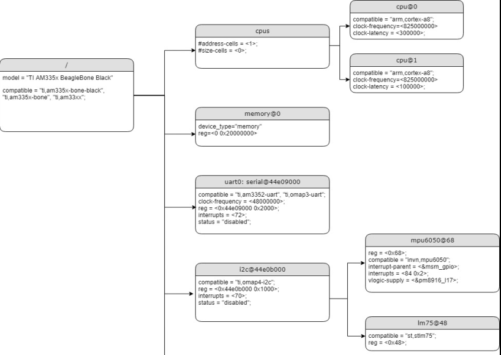

# Device tree

### 1. What is device tree (DT)?
1. It's a way of data exchange format used for exchanging HW description data with the SW or OS.
2. A way to describe non-discoverable devices (platform devices) to the linux kernel

### 2. How to get device tree specification?
> https://www.devicetree.org  

### 3. How to write a device tree?
> Note: There is hierarchy for the DT as the HW has one. hierarchy might differ from target to another.  

> 1. SOC level  
> 2. SOC has an on-chip peripherals level  
> 3. The board peripherals level, like sensors, LEDs, buttons  

### 4. Where is the location of the device tree files?
> /arch/arm/boot/dts/**Silicon-Provider**

### 5. Explain the modular approach to manage DT files on Beaglebone Black?
> Note: top level nodes overrides the low level nodes (these levels are defined by my of studying purposes)
1. level 1: AM335x.dtsi
2. level 2: Beagle-bone-common.dtsi
3. level 3: Beaglebone-black-common.dtsi
4. level 4: beaglebone-black.dts |OR| beaglebone black wireless.dts (includes all of the above)

### 6. Explain device tree structure?
1. Every device tree file should contain a root node.
```C
/ { /* root node*/

    Node-1 { /* SOC level node | device node*/
        Child-Node-1 { /* Child node of node-1 | device node*/

        };
    };

    Node-2 { /* SOC level node | Device node*/
        Child-Node-1 { /* Child node of node-1, sibling of Child-Node-2 | device node*/

        };

        Child-Node-2 { /* Child node of node-1 | device node*/

        };
    };
};
```


---
